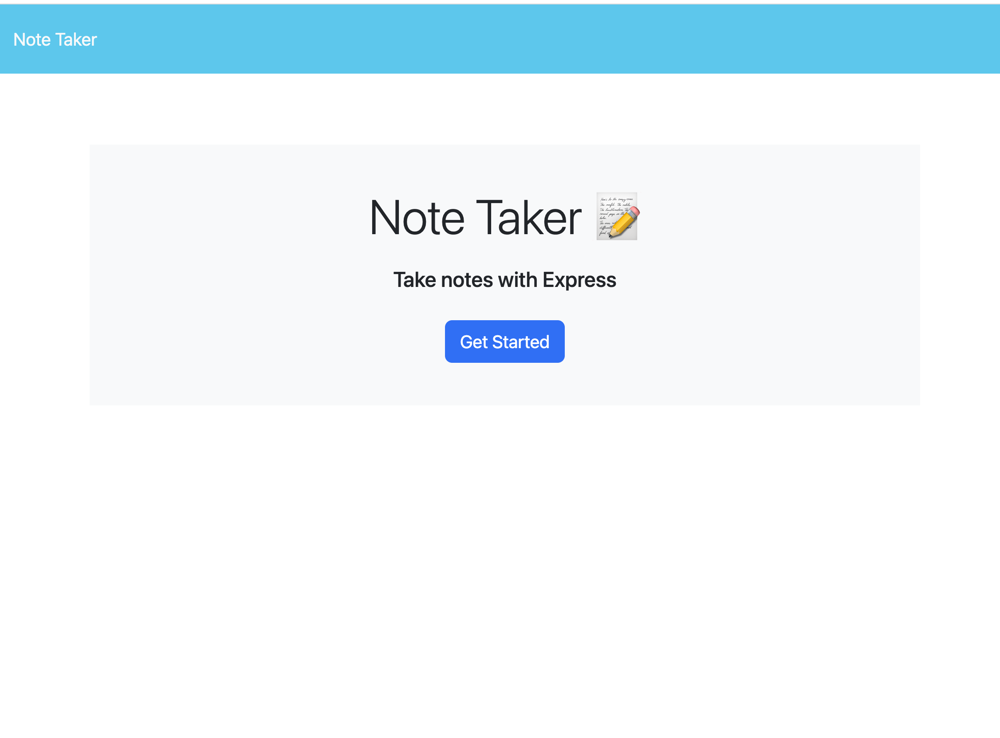

# Note Taker App  
  
 # Table of Contents  
   
1. [Description](#description)  
2. [Installation](#installation)  
3. [Usage](#usage)  
4. [License](#license)  
5. [Contributions](#contributions)  
6. [Tests](#tests)  
7. [Questions](#questions)  
8. [Screenshots](#screenshots)  
9. [Links](#links)  
## Description  
Web application using node, heroku, and express to create a list of notes where single notes can be saved and added to a list,clicked to be displayed, and deleted.  
  
## Installation  
Node is needed to run the server scripts. NPMs such as express, fs, path, and uuid is needed for the script tofunction. Heroku was used for deployment. Insomnia can be used to run app requests outside of the deployed site.  
  
## Usage  
If someone wants to store a list of ideas where they can go more into detail than just a title line, they can use this app to take note and elaborate on their ideas.  
  
## Contributions  
Not open to contributions at the moment.   
   
## Questions  
Take a closer look at this repo and my other work by visiting my GitHub with the link below, or contact me directly by email.  
GitHub: https://github.com/ShannyaN  
Email: niveyro101@gmail.com 

## Screenshots  
 

## Links  
Deployed site: https://dry-forest-54204.herokuapp.com/  
Repository: https://github.com/ShannyaN/ele-NoteTaker